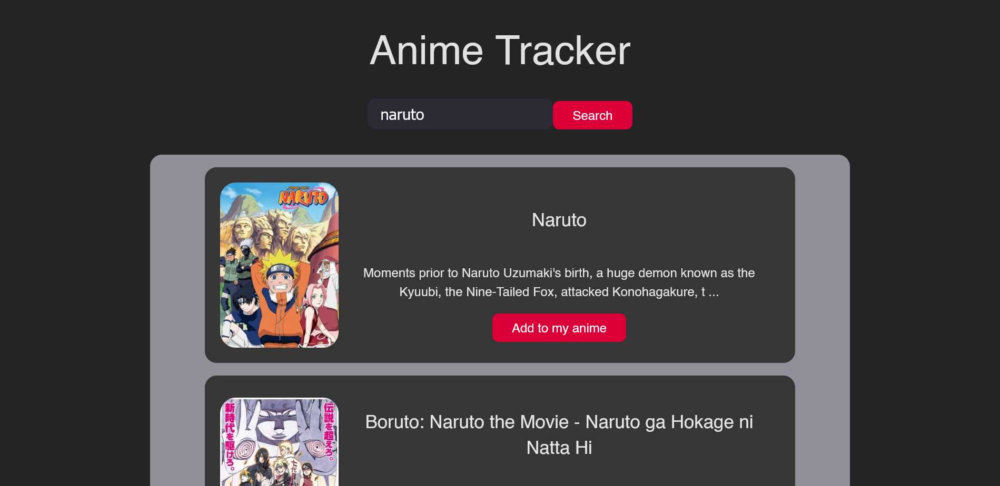
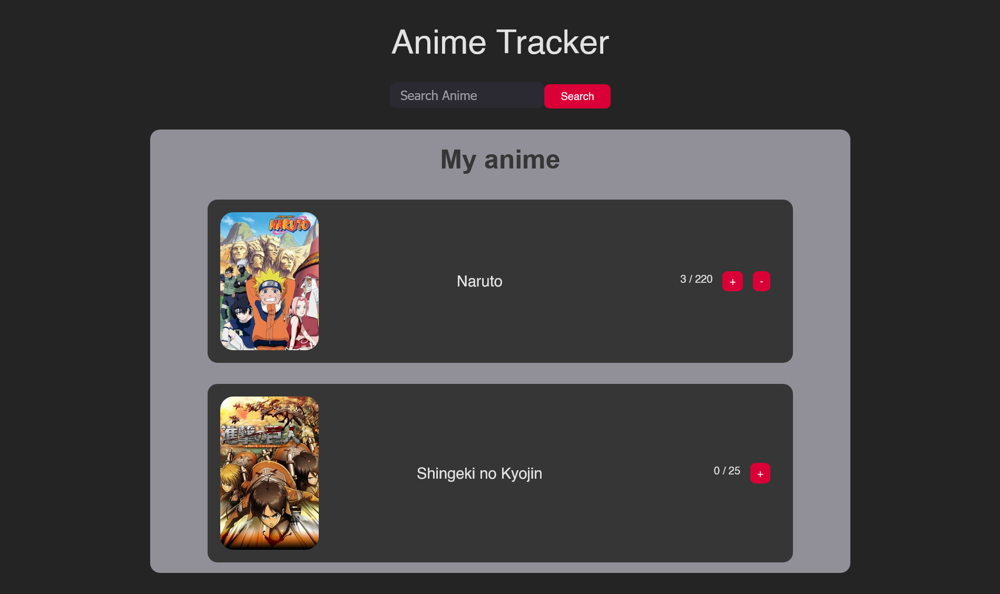

# Anime Tracker

An anime tracker where you can search for your favourtie anime and add it to the list. You can track the number of episodes you watched vs the number of episodes left.
Made using Vite and Vue 3.

[Live Site url](https://anime-tracker-six.vercel.app/)

## Screenshots

- Search for anime
  

- View your anime
  

## Vue 3 + Vite

This template should help get you started developing with Vue 3 in Vite. The template uses Vue 3 `<script setup>` SFCs, check out the [script setup docs](https://v3.vuejs.org/api/sfc-script-setup.html#sfc-script-setup) to learn more.

## Recommended IDE Setup

- [VS Code](https://code.visualstudio.com/) + [Volar](https://marketplace.visualstudio.com/items?itemName=Vue.volar)
